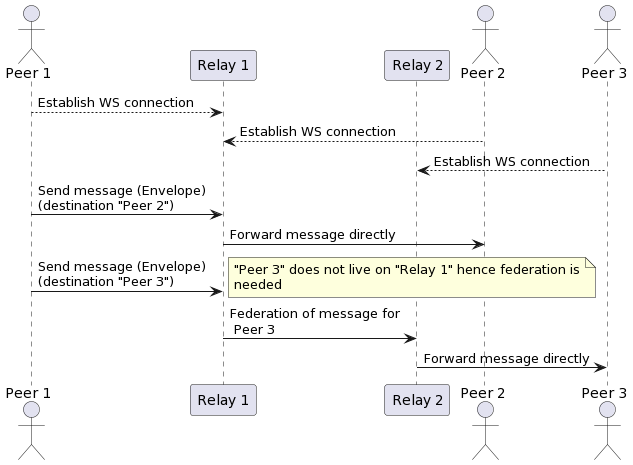
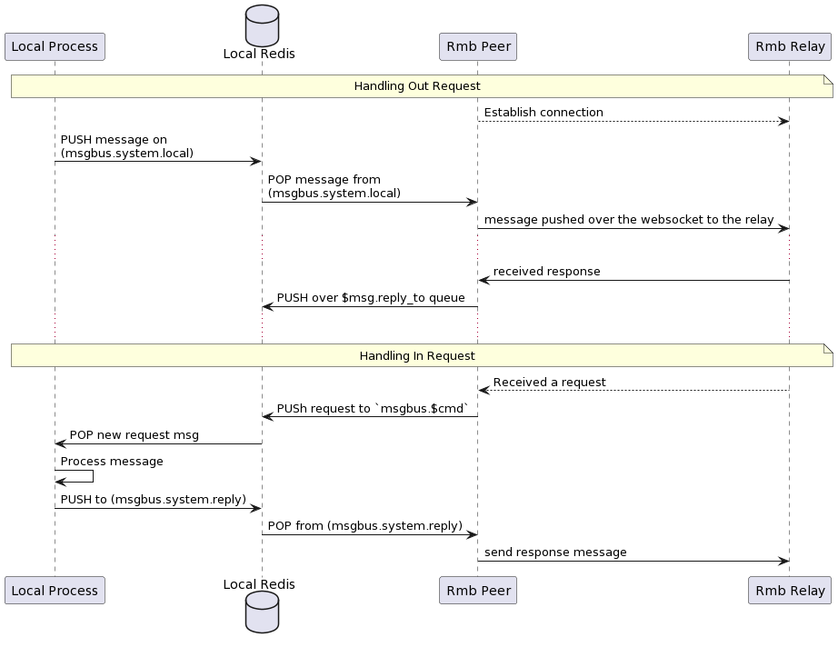

# RMB

RMB is (reliable message bus) is a set of protocols and a `relay` server that aims to abstract inter-process communication between multiple processes running over multiple nodes.

The point behind using RMB is to allow the clients to not know much about the other process, or where it lives (client doesn't know network addresses, or identity). Unlike HTTP(S) where the caller must know exact address (or dns-name) and endpoints of the calls. Instead RMB requires you to only know about

- Twin ID (numeric ID) of where the service can be found
- Command (string) is simply the function to call
- The request "body" which is binary blob that is passed to the command as is
  - implementation of the command need then to interpret this data as intended (out of scope of rmb)

Twins are stored on tfchain. hence identity of twins is granted not to be spoofed, or phished. When a twin is created he needs to define 2 things:

- RMB RELAYS
- His Elliptic Curve public key (we use secp256k1 (K-256) elliptic curve)

Once all twins has their data set correctly on the chain. Any 2 twins can communicate with full end-to-end encryption as follows:

- A twin establish a WS connection to his relays
- A twin create an `envelope` as defined by the protobuf schema
- Twin fill end all envelope information (more about this later)
- Twin pushes the envelope to one of his relays
When received by the relay, it will determine whether to deliver the message to one of its directly connected clients or to a remote relay. the message processed as follows:
  - If the destination twin is also using the same relay, local route will have priority over others and message is directly forwarded to this twin.
  - If federation is needed (twin using different relay), message is forwarded to one of the twin's relays.

Any new messages that is designated to this twin, is pushed over the websocket to this twin. The twin can NOT maintain multiple connections to same relay hence a small tool (rmb-peer) is provided that runs as a dispatcher for a single twin identity.

This rmb-peer tool makes it possible to run multiple services behind this twin and push replies back to their initiators

## Overview of the operation of RMB relay



### Connections

The relay can maintain **MULTIPLE** connections per peer given that each connection has a unique **SID** (session id). But for each (twin-id, session-id) combo there can be only one connection. if a new connection with the same (twin-id, session-id) is created, the older connection is dropped.

The `rmb-peer` process reserved the `None` sid. It connection with No session id, hence you can only run one `rmb-peer` per `twin` (identity). But the same twin (identity) can make other connection with other rmb clients (for example rmb-sdk-go direct client) to establish more connections with unique session ids.

### Federations

Starting from version 1.1.0, the federation field has been deprecated, and the logic of federation has moved to happen in the relays. Relay is now responsible for determining whether to deliver the message to one of its directly connected clients or to a remote relay.

Relay now has an in-memory ranking system to rank its known relays according to their known mean failure rate over a recent configured period of time (time window).

The ranking system used to give a hint to the router (when a twin has multiple configured relays on-chain) to try the relays that have a higher chance of working first, minimizing routing messages to services that failed recently (minimizing the latency).

The rank of a relay will heal over time because the system will only consider failures in the recent time frame, allowing the router to revisit the relay and distribute the load between all working services. For relays with the same failure rate, the order will be randomized.

The ranker time window can be configured when starting the relay by specifying the period in seconds after the `--ranker_period` option. If the option is omitted, the default value of one hour will be used.

Example:

```bash
rmb-relay --substrate wss://tfchain.dev.grid.tf:443 --domain r1.3x0.me --ranker-period 1800
```

### Peer

Any language or code that can open `WebSocket` connection to the relay can work as a peer. A peer need to do the following:

- Authenticate with the relay. This is by providing a `JWT` that is signed by the twin key (more on that later)
- Handle received binary mesasge
- Send binary messages

Each message is an object of type `Envelope` serialized as with protobuf. Type definition can be found under `proto/types.proto`

### Peer implementation

This project already have a peer implementation that works as local peer gateway. By running this peer instance it allows you to
run multiple services (and clients) behind that gateway and they appear to the world as a single twin.

- The peer gateway (rmb-peer) starts and connects to his relays
- If requests are received, they are verified, decrypted and pushed to a redis queue that as command specific (from the envelope)
- A service can then be waiting on this redis queue for new messages
  - The service can process the command, and push a response back to a specific redis queue for responses.
- The gateway can then pull ready responses from the responses queue, create a valid envelope, encrypt, and sign and send to destination



#### `rmb-peer` message types

To make it easy for apps to work behind an `rmb-peer`, we use JSON message for communication between the local process and the rmb-peer. the rmb-peer still
maintains a fully binary communication with the relay.

A request message is defined as follows

##### Output requests

This is created by a client who wants to request make a request to a remote service

> this message is pushed to `msgbus.system.local` to be picked up by the peer

```rust
#[derive(Serialize, Deserialize, Clone, Debug)]
pub struct JsonOutgoingRequest {
    #[serde(rename = "ver")]
    pub version: usize,
    #[serde(rename = "ref")]
    pub reference: Option<String>,
    #[serde(rename = "cmd")]
    pub command: String,
    #[serde(rename = "exp")]
    pub expiration: u64,
    #[serde(rename = "dat")]
    pub data: String,
    #[serde(rename = "tag")]
    pub tags: Option<String>,
    #[serde(rename = "dst")]
    pub destinations: Vec<u32>,
    #[serde(rename = "ret")]
    pub reply_to: String,
    #[serde(rename = "shm")]
    pub schema: String,
    #[serde(rename = "now")]
    pub timestamp: u64,
}
```

##### Incoming Response

A response message is defined as follows this is what is received as a response by a client in response to his outgoing request.

> this response is what is pushed to `$ret` queue defined by the outgoing request, hence the client need to wait on this queue until the response is received or it times out

```rust
#[derive(Serialize, Deserialize, Clone, Debug)]
pub struct JsonError {
    pub code: u32,
    pub message: String,
}

#[derive(Serialize, Deserialize, Clone, Debug)]
pub struct JsonIncomingResponse {
    #[serde(rename = "ver")]
    pub version: usize,
    #[serde(rename = "ref")]
    pub reference: Option<String>,
    #[serde(rename = "dat")]
    pub data: String,
    #[serde(rename = "src")]
    pub source: String,
    #[serde(rename = "shm")]
    pub schema: Option<String>,
    #[serde(rename = "now")]
    pub timestamp: u64,
    #[serde(rename = "err")]
    pub error: Option<JsonError>,
}
```

##### Incoming Request

An incoming request is a modified version of the request that is received by a service running behind RMB peer
> this request is received on `msgbus.${request.cmd}` (always prefixed with `msgbus`)

```rust
#[derive(Serialize, Deserialize, Clone, Debug)]
pub struct JsonIncomingRequest {
    #[serde(rename = "ver")]
    pub version: usize,
    #[serde(rename = "ref")]
    pub reference: Option<String>,
    #[serde(rename = "src")]
    pub source: String,
    #[serde(rename = "cmd")]
    pub command: String,
    #[serde(rename = "exp")]
    pub expiration: u64,
    #[serde(rename = "dat")]
    pub data: String,
    #[serde(rename = "tag")]
    pub tags: Option<String>,
    #[serde(rename = "ret")]
    pub reply_to: String,
    #[serde(rename = "shm")]
    pub schema: String,
    #[serde(rename = "now")]
    pub timestamp: u64,
}
```

Services that receive this needs to make sure their responses `destination` to have the same value as the incoming request `source`

##### Outgoing Response

A response message is defined as follows this is what is sent as a response by a service in response to an incoming request.

Your bot (server) need to make sure to set `destination` to the same value as the incoming request `source`

The
> this response is what is pushed to `msgbus.system.reply`

```rust
#[derive(Serialize, Deserialize, Clone, Debug)]
pub struct JsonOutgoingResponse {
    #[serde(rename = "ver")]
    pub version: usize,
    #[serde(rename = "ref")]
    pub reference: Option<String>,
    #[serde(rename = "dat")]
    pub data: String,
    #[serde(rename = "dst")]
    pub destination: String,
    #[serde(rename = "shm")]
    pub schema: Option<String>,
    #[serde(rename = "now")]
    pub timestamp: u64,
    #[serde(rename = "err")]
    pub error: Option<JsonError>,
}
```

## End2End Encryption

Relay is totally opaque to the messages. Our implementation of the relay does not poke into messages except for the routing attributes (source, and destinations addresses, and federation information). But since the relay is designed to be hosted by other 3rd parties (hence federation) you should
not fully trust the relay or whoever is hosting it. Hence e2e was needed

As you already understand e2e is completely up to the peers to implement, and even other implementations of the peers can agree on a completely different encryption algorithm and key sharing algorithm (again, relay does not care). But in our implementation of the e2e (rmb-peer) things goes like this

- Each twin has a `pk` field on tfchain. when rmb-peer start, it generates an `secp256k1` key from the same seed as the user tfchain mnemonics. Note that this will not make the encryption key and the signing key any related, they just are driven from the same seed.
- On start, if the key is not already set on the twin object, the key is updated.
- If a peer A is trying to send a message to peer B. but peer B does not has his `pk` set, peer A will send the message in plain-text format (please check the protobuf envelope type for details)
- If peer B has public key set, peer A will prefer e2e encryption and will does the following:
- Drive a shared secret point with `ecdh` algorithm, the key is the `sha256` of that point
- `shared = ecdh(A.sk, B.pk)`
- create a 12 bytes random nonce
- encrypt data as `encrypted = aes-gcm.encrypt(shared-key, nonce, plain-data)`
- create cipher as `cipher nonce + encrypted`
- fill `envelope.cipher = cipher`
- on receiving a message peer B does the same in the opposite direction
- split data and nonce (nonce is always first 12 bytes)
- derive the same shared key
- `shared = ecdh(B.sk, A.pk)`
- `plain-data = aes-gcm.decrypt(shared-key, nonce, encrypted)`

## Rate Limiting

To avoid abuse of the server, and prevent DoS attacks on the relay, a rate limiter is used to limit the number of clients' requests.\
It was decided that the rate limiter should only watch websocket connections of users, since all other requests/connections with users consume little resources, and since the relay handles the max number of users inherently.\
The limiter's configurations are passed as a command line argument `--limit <count>, <size>`. `<count>` represents the number of messages a twin is allowed to send in each time window, `<size>` represents the total size of messages in bytes a twin is allowed to send in each time window.\
Currently there are two implementations of the rate limiter:

- `NoLimit` which imposes no limits on users.
- `FixedWindowLimiter` which breaks the timeline into fixed time windows, and allows a twin to send a fixed number of messages, with a fixed total size, in each time window. If a twin exceeded their limits in some time window, their message is dropped, an error message is sent back to the user, the relay dumps a log about this twin, and the user gets to keep their connection with the relay.

## Substrate connections

To make the relay and peer more reliable, the substrate client accepts multiple substrate urls.
> To provide multiple urls use the `--substrate <url>` command line argument multiple times.

Example:

```bash
  rmb-peer --substrate wss://tfchain.grid.tf:443 --substrate wss://02.tfchain.grid.tf:443 --substrate wss://03.tfchain.grid.tf:443
```

It's important to note the only one substrate client is held at a time, and the other urls are only used in the case of a network failure.\
This way, if a substrate connection failed, other urls are used to try to connect to substrate.\
The client uses iterates between urls in a Round Robin fashion, and tries to reconnect. If a specified number of trials is done (currently 2x the number of urls) and none of them was successful, the client fails and returns and error.

## redundancy and failover

Starting from version 1.1.0, RMB has integrated redundancy and failover into the system to achieve high availability.
This is done by allowing RMB-peer to set more than one relay domain for a twin on-chain and establish connections with several redundant relays at the same time.

Enabling failover ensures that communication between twins can continue even if one of the relays fails, as the client will eventually route the message to its destination through another operational relay.

Example:

```bash
  rmb-peer -m "{MNEMONIC}" --substrate wss://tfchain.dev.grid.tf:443 --relay wss://r1.dev.grid.tf --relay wss://r2.dev.grid.tf
```

## Relay Domains

Starting from v1.3.4, the relay supports multiple domains (when needed), which are used to determine whether a destination twin is directly connected to this relay. these domains should be points to the public IP of this relay.

```bash
rmb-relay --domain relay.example.com relay1.example.com
```

or short name

```bash
rmb-relay -m relay.example.com relay1.example.com
```

The relay will internally route messages over existing WebSocket connections to twins that use one of the provided domains as their relay domain. If the destination twin isn't associated with any of these domains, the message will be forwarded to one of the twin's relays via federation (https protocol).
