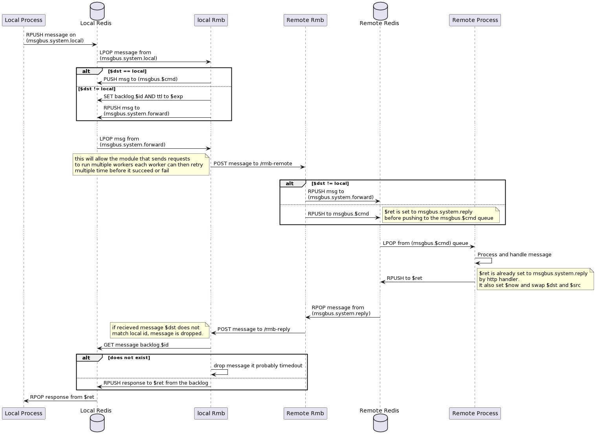

# RMB
RMB is (reliable message bus) is a set of tools (client and daemon) that aims to abstract inter-process communication between multiple processes running over multiple nodes.

The point behind using RMB is to allow the clients to not know much about the other process, or where it lives (client doesn't know network addresses, or identity). Unlike HTTP(S) where the caller must know exact address (or dns-name) and endpoints of the calls. Instead RMB requires you to only know about
- Twin ID (numeric ID) of where the service can be found
- Command (string) is simply the function to call

A single node can run multiple services behind a single RMB instance (on one node). Which means multiple commands can be handled by multiple processes running on the same node. But reachable only over a single RMB (with single node id) instance.

> It's illegal to run multiple RMBs on a single node, unless each using it's own separate redis instance otherwise they will conflict on redis queue.

## Overview of the operation of RMB


The process can be summarized as follows:
### Client
- A local process wants to call a function on remote/local process. It only know which twin-id, and the function (command) to run. The client also need to know what data the remote function expect.
- The local process creates a message. In it's minimal form, a message is
  - id: unique id of the message, it's the client responsibility to create a unique ID (uuid4 is recommended)
  - dst: Twin ID to handle the request (can be multiple)
  - cmd: the remote command name
  - data: payload of the command data (request body)
  - ret: return queue where the client expect the command response to arrive. Can be anything (unique to the process), but ideally can be the same `id` as the message itself. A client implementation can choose to have one queue for all responses depends on the implementation.
- Once the client construct the full message, it pushes it to it's local redis on specific queue (msgbus.system.local)
- The client then just wait on response on the `ret` queue.

### RMB (local)
is called `rmb-peer` which is RMB running in peer mode. A peer is a terminal where processes on this local node can use to communicate to other peers. `rmb-peer` require to be given a public url of `rmb-rely`. `rmb-rely` are discussed later but they are the backbone of the rmb network.

- On start, `rmb` makes sure the associated twin information on the chain has his correct information, this include:
 - `rely` server url normally in `ws://<server>/peer` format (or `wss`)
 - `public-key` the public key of the twin used for encryption. usually a curve25519 key (to be researched)
- RMB waits on messages coming over the `msgbus.system.local` queue. One a message arrives a message processing happens as follows:
  - verify message body is valid
  - verify dst twins are valid, for each twin in the list the identity and the IP of the dst twin is retrieved and cached if not already in cache.
  - if one or more twins are invalid, the message can't be processed, and an error message is pushed directly tot the `$ret` queue. with details of the error.
  - if $dst == $local  (where $local is local twin id) the msg is immediately forwarded to `msgbus.$cmd` for local processing by a local process. This takes RMB out of the picture for local inter process communication. Because the local receiver will just reply to the msg $ret which is waited on by the client process.
  - if $dst != local, this message is intended for remote process The message is then stored in redis on key (backlog.$id) AND a TTL is set on that with $exp. This means a message that never receive a response will eventually be flushed out of redis memory.
  - for each $twin in $dst the string ($id:$twin) is pushed to `msgbus.system.forward`. This will allow messages to be sent (and retried) in parallel to multiple destinations.
- The ids pushed to the `msgbus.system.forward` are handled in another routine of the system as follows:
  - The RMB maintain a set of workers, those workers are waiting for jobs pushed to them on a queue
  - When an ID ($id:$twin) is received on `msgbus.system.forward` queue the message is retrieved from `backlog.$id` then **signed**, and pushed to my `rmb-rely`.

### RMB (local) again
- If a message is received, if $dst != $local an http 403 Forbidden is returned.
- Original message is GET from the backlog. If message does not exist anymore, message is dropped since client is probably not expecting a response anymore.
- If message still available, response is pushed to $ret (from the original message from the backlog)

### RMB (rely)
`rmb-rely` is rmb running in rely mode. Anyone can host a rely as long as it has a public IP (v4, v6 or both). The choice of the type of the IP is very important because
it can cause segmentation of the rmb network. Imagine having 2 rmb-relys that one of them run ipv4 and other on ipv6, having 2 peers connected to each rely will fail to communicate because the rmb-relys can not communicate, hence federation will not be possible. Hence **IPv4** is preferred for now.

- Once a peer connects to the rely, it needs to authenticate by means of digital signature to prove it's indeed that peer it claims it is. Can be done with a signed jwt that has peer signature. Once it's connected, messages received by that peer are forwarded directly to the connected peer. Also messages to be relied are accepted.
- When a message is received from a peer, the destination peer (twin) information is then fetched, to inspect which `rely` it's connected to. this can be either same `rely` (self), or a `remote` rely, or not set!
- If twin does not has a rely configured, an error is returned immediately that twin is not route-able.
- If same rely message is pushed to the queue of the `peer` waiting for it receive those messages
- If on remote rely, an http request is made to the remote peer on a special endpoint `http(s)://<server>/rely`.
  - If federation failed to send (after certain amount of retries) error is returned to caller with proper error
- On the remote `rely`
  - Once a message is received on `/rely` endpoint, if the dst twin is not one of my peers (from twin info). message is discarded, an error is returned (choose proper http code)
  - If twin is indeed one of my peers, message is queued for delivery.

# Components
This is a rough guide of the separate entities that can be developed in parallel. Of course this can be modified and tweaked during development to make sure it operates as intended.

## The message
> NOTE: messages formats below are work on progress the final format can be a little bit different to be cleaner.

### `app` to `rmb-peer`
This is the message sent by a local application running next `rmb-peer` over the redis bus. Currently this message is `json` since not all languages support protobuf or binary formats. Since this never leaves the machine, it's okay to have a bulky format as long as it makes integration with apps easier.

```json
{
  "ver": 2,                                # version identifier (always 1 for now)
  "cmd": "wallet.stellar.balance.tft",     # command to call (aka function name)
  "exp": 3600,                             # expiration in seconds (relative to 'now')
  "try": 4,                                # amount of retry if rely cannot be reached
  "dat": "R0E3...2WUwzTzdOQzNQUlkN=",      # data base64 encoded
  "dst": [1002],                           # list of twin destination id (filled by client)
  "ref": "id",                             # ref is an id selected by the app and should be returned as is.
                                           # can be considered a sort of message ID.
  "ret": "5bf6bc...0c7-e87d799fbc73",      # return queue expected (please use uuid4)
  "now": 1621944461,                       # sent timestamp (filled by client)
  "err": {
    "code": 0,
    "body": "data",
  },                                       # err is an optional part of the message mainly used by replies
}
```
### `rmb-peer` to `rmb-rely`
This will use `protobuf` to improve the message size but this now a description of basic fields of the message. but will look different in the protobuf schema.
The message here is sent for each dst twin. Because encryption done here using the twin public key. Hence is needed for each
```json
{
  "uid": "uuid4",                          # unique id (filled by rmb-peer)
  "cmd": "wallet.stellar.balance.tft",     # command to call (aka function name)
  "exp": 3600,                             # expiration in seconds (relative to 'now')
  "try": 4,                                # amount of retry if rely cannot be reached
  "dat": "<binary>",                       # encrypted(plain-bytes)
  "src": 1001,                             # source twin id (filled by server)
  "dst": 1002,                             # destination twin id (filled by client)
                                           # this is now for a single twin.
  "ret": "5bf6bc...0c7-e87d799fbc73",      # return queue expected (please use uuid4)
  "sig": "<binary>",                       # signature of sender peer
  "now": 1621944461,                       # sent timestamp (filled by client)
}
```

### `rmb-rely` to `rmb-rely`
rely will forward the message as is to other rely if needed.

### `rmb-rely` to `rmb-peer`
rely will forward the message as is to peer.

### `rmb-peer` to `app`
the message is expanded back to the proper json format, and pushed to the app.

# File uploads
TBD
